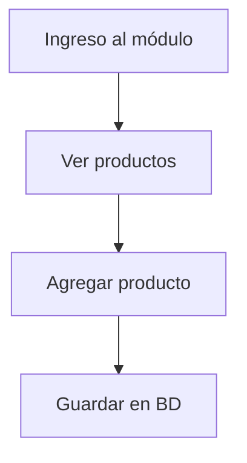

# Elementors de protecto
**Descripción breve:**  
Explica en 1 o 2 líneas para qué sirve este módulo.

---

## Requerimientos funcionales
- Qué problema resuelve
- Quiénes lo usan (roles)
- Casos de uso principales

---

## Esquema / Diagrama
*(Opcional pero recomendado)*  
- Diagrama de flujo, UML o ER
- Descripción del diagrama

---

## Base de datos
### Tablas involucradas
- Nombre de tabla
- Campos principales
- Relaciones

### Migraciones
- Archivos de migración a ejecutar
- Seeders relacionados

---

## Clases y funciones clave
- Controladores
  - Nombre, método, ruta
  - Descripción breve
- Modelos
  - Relaciones
  - Métodos personalizados
- Requests/Policies
  - Validaciones
- Servicios/helpers
  - Descripción

---

## Cambios importantes / Historial
- Fecha / Desarrollador / Descripción del cambio
- Motivo de cambios importantes
- Implicaciones (compatibilidad, seguridad, etc.)

---

## Dependencias o módulos relacionados
- Qué otro módulo usa este
- Qué módulos dependen de este

---

## Consideraciones para desarrollo futuro
- Problemas conocidos
- Ideas de mejora
- Riesgos o advertencias

---

## Referencias
- Pull Requests
- Tickets / Issues
- Documentos externos](<#  Módulo: Inventario

##  Descripción general
Este módulo permite gestionar productos, entradas, salidas y reportes de stock.

## Estructura
- Modelos: `Producto`, `Movimiento`
- Controladores: `InventarioController`, `ReporteController`
- Vistas: `inventario/index.blade.php`, etc.

## Casos de uso
- Registrar producto nuevo
- Entrada manual de inventario
- Salida por venta

## Componentes reutilizados
- [[Formulario Dirección]]
- [[Generación reportes]]

## Permisos
- `inventario.ver`
- `inventario.editar`

## Flujos de proceso

