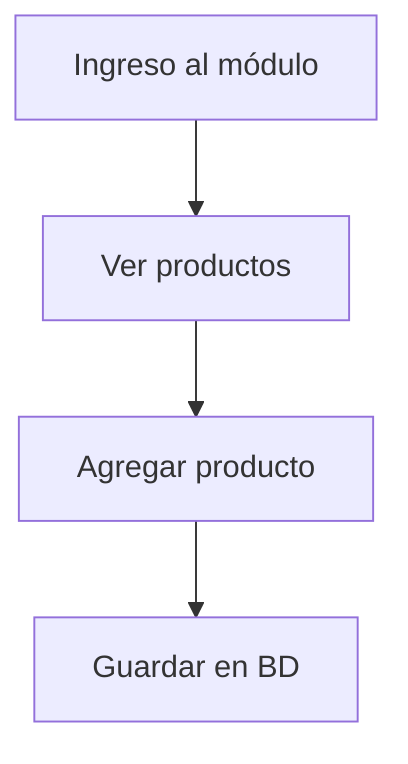

# 📂 Módulo: Inventario

## 🧩 Descripción general
Este módulo permite gestionar productos, entradas, salidas y reportes de stock.

## 🗂️ Estructura
- Modelos: `Producto`, `Movimiento`
- Controladores: `InventarioController`, `ReporteController`
- Vistas: `inventario/index.blade.php`, etc.

## 🧪 Casos de uso
- Registrar producto nuevo
- Entrada manual de inventario
- Salida por venta

## 🔗 Componentes reutilizados
- [[FormularioProducto]]
- [[TablaProductos]]

## 🔐 Permisos
- `inventario.ver`
- `inventario.editar`

## 🔁 Flujos de proceso

## 📎 Endpoints

|Método|Ruta|Descripción|
|---|---|---|
|GET|`/inventario`|Listar productos|
|POST|`/inventario/agregar`|Añadir nuevo producto|

## 🧩 Dependencias

- [[Componentes/FormularioProducto]]
    
- [[Guías/Instalación de Laravel]]

